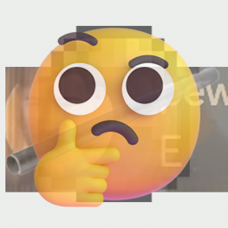

<h1 align="center">SyFB_Strange</h1>

这个是SystemFileB开发的一个基于MCreator的Mod (以后可能不会继续用它了)，包含了一些一般人想不到的的物品，附魔等 
大部分物品都包含了对应的梗，在Wiki中会提到，比如钢管之类的

可能会破坏原版的生存模式平衡，请谨慎游玩

这个Mod的支持版本尽可能跟进MCreator的生成器支持的版本，可能不会考虑Fabric

Mod的内容会穿插在[我的视频里](https://www.bilibili.com/list/1376977060)

以后我会写个Wiki供大家查询

## 🙏 贡献者
受害者 (确信)

现在还没有任何一个人...  
愣着干啥，赶紧提PR!

## ⚖️ 许可证
代码使用 LGPLv3  
图标使用 CC BY-SA 4.0

图标还使用到了以下素材：
- Minecraft的水桶 (倒置) - © Mojang (原材质)
- 钢管 - 😅 我也不知道要写什么版权标识
- [Beluga的视频](https://www.bilibili.com/video/BV1dm421N7En)截图 - © Beluga
- [FluentUI-Emoji](https://github.com/microsoft/fluentui-emoji)的思考表情 - MIT License